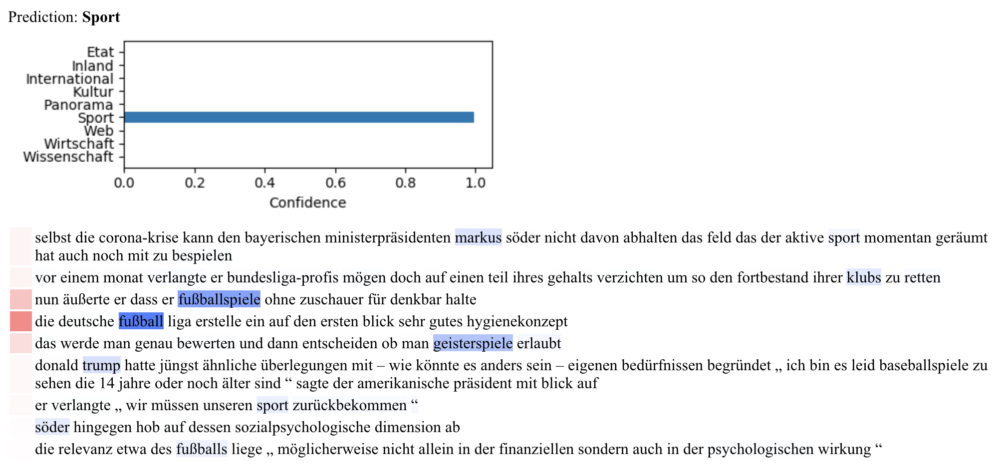

# Hierarchical Attention Networks for Document Classification

An implementation of Hierarchical Attention Networks for Document Classification from the following paper:


## Content
This repo contains the following:
- Implementation of the Network Architecture with the following technologies
    - Keras
    - Preprocessing with spaCy
    - Embedding Layer with pretrained Glove vectors
    - Tokenizing with Keras tokenizer
- Utilities to train the model on the *Ten Thousand German News Article Dataset* (https://github.com/tblock/10kGNAD)
- Jupyter Notebook used during initial development of the network
- REST API server developed with FastAPI for predicting on a trained model and display of the sentence and word attentions in html 

## Get started
- Download german word vectors pretrained by Deepset (https://deepset.ai/german-word-embeddings)
from here `https://int-emb-glove-de-wiki.s3.eu-central-1.amazonaws.com/vectors.txt` and place them in the directory ``embeddings/glove_german/``
- The dataset can be downloaded from ``https://github.com/tblock/10kGNAD/blob/master/articles.csv``. Place the articles.csv file in the directory ``data/``

## Train the model
Run the training script `train_script.py`

## Start the server
Running 
```
uvicorn app.app:app
```
starts the server under `http://127.0.0.1:8000` 

### Access the API docs
After running the server the API docs can be accessed via `http://127.0.0.1:8000/docs`
 
### Make predictions
Send a HTTP request to the running server, e.g.
```
curl --location --request GET 'http://127.0.0.1:8000/predict/?text=<your-text-to-be-classifier>'
```

### Visualize prediction and attentions
Send a HTTP request to the running server, e.g.
```
http://127.0.0.1:8000/visualize/?text=<your-text-to-be-classifier>
```
The server responds with a static html which should look something like the following:

